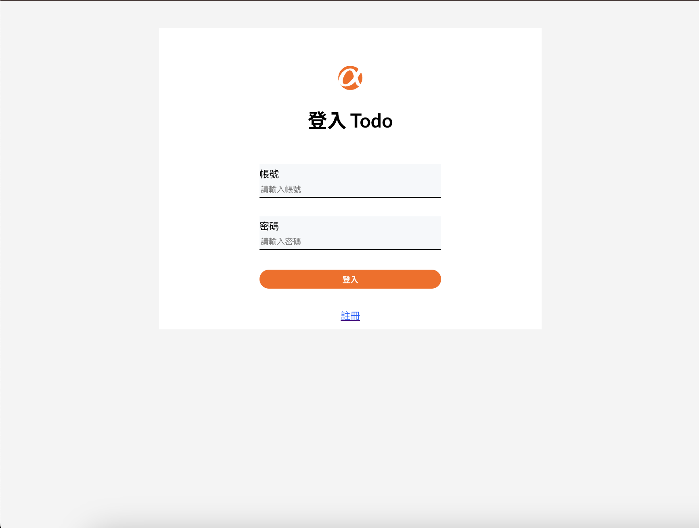

# The Todo list - build with React

This is a exercise to build todo list with React.

# Feature

- Users can view all of their todos.
- Users can add new todo.
- Users can delete todo.
- Users can mark todo as complete or not.
- Users can double-click on todo in the list to edit its content.

# Screenshot:




## Built with

- React
- React Router
- clsx
- sweetalert2
- axios
- JSON web token
- git

## Try it on the GitHub pages

- Live URL: https://yacodingroom.github.io/login

## Or clone it and..

### Install package

```Shell
npm install clsx sweetalert2 axios jsonwebtoken
```

### Runs the app

```Shell
npm start
```

## Author

- ALPHA camp
- YAL

## Acknowledgments

- Ivy&Ciao
- Dr. Angela
- Mr. Jonas
- ALPHA camp
- and me.
