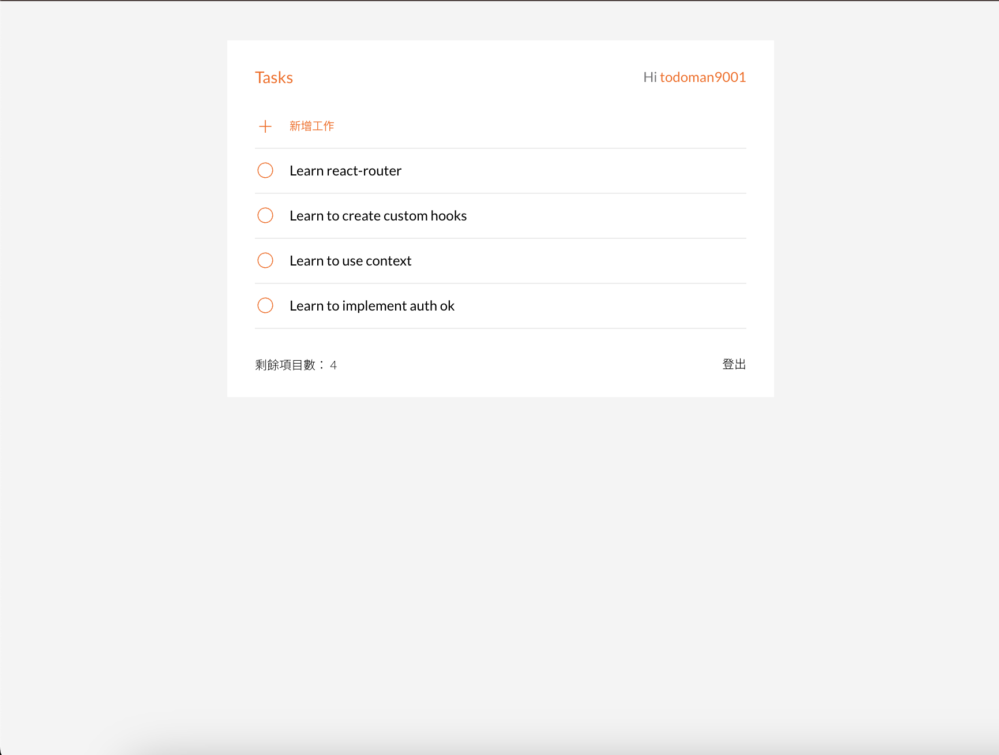
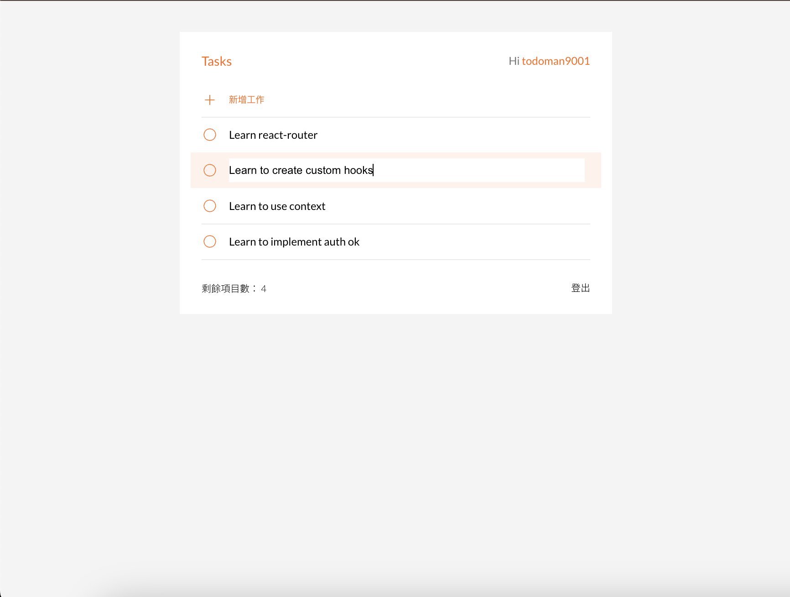

# The Todo list - build with React

This is a exercise to build todo list with React.

# Feature

- Users can view all of their todos.
- Users can add new todo.
- Users can delete todo.
- Users can mark todo as complete or not.
- Users can double-click on todo in the list to edit its content.

# Screenshot:




## Built with

- React

## Runs the app

```Shell
npm start
```

## Author

- ALPHA camp
- YAL

## Acknowledgments

- Ivy&Ciao
- Dr. Angela
- Mr. Jonas
- ALPHA camp
- and me.
